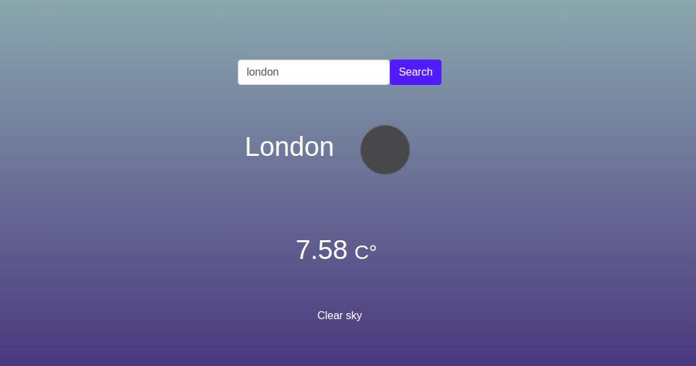

# Project Name

> This project was created in order to practice and learn basic frontend using JavaScript and DOM.

It was built completely using only HTML and JavaScript changes the Background color every time the user clicks the button.

## Built With

- JavaScript
- Bootstrap
- HTML

## Live Demo

[Live Demo Link](https://jssarrazolaa.github.io/WeatherApp/)

## Getting Started

To get a local copy up and running follow these simple example step:

- Get a copy of the repo by copying this command `git clone https://github.com/jssarrazolaa/WeatherApp.git`
and running it into the terminal.

- Run `npm install` in your terminal.

- Run `npm run start` to start the local server.

- Finally go to `http://localhost:8080/dist/` and you will be able to interact with the app there.

### Prerequisites

- Nodejs
- VSCode
- Eslint
- Stylelintrc

## Authors

👤 **Author1**

- GitHub: [@jssarrazolaa](https://github.com/jssarrazolaa)
- Twitter: [@StevenAlvarez_](https://twitter.com/StevenAlvarez_)
- LinkedIn: [Jhonatan Sarrazola](https://www.linkedin.com/in/jhonatansarrazola/)

## 🤝 Contributing

Contributions, issues, and feature requests are welcome!

Feel free to check the [issues page](https://github.com/jssarrazolaa/WeatherApp/issues).

## Show your support

Give a ⭐️ if you like this project!

## Acknowledgments

- FreeCodeCamp
- Microverse

## 📝 License

This project is [MIT](lic.url) licensed.